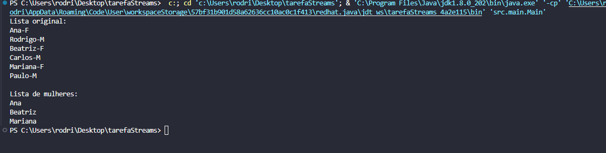

<!DOCTYPE html>
<html lang="pt-br">
<head>
    <meta charset="UTF-8">
    <meta name="viewport" content="width=device-width, initial-scale=1.0">
    <meta name="description" content="Descrição detalhada do projeto em Java utilizando streams e filtragem de dados.">
    <meta name="keywords" content="Java, Streams, Filtragem de Dados, Projeto">
    <meta name="author" content="Ana Alice Rodrigues">
</head>
<body>

<header>
    <h1>Projeto Java - Filtragem de Dados com Streams</h1>
    
</header>

    
Índice

    <ol>
        <li><a href="#sobre-o-projeto">Sobre o projeto</a></li>
        <li><a href="#parte-tecnica">Parte Técnica</a></li>
        <li><a href="#estrutura-dos-arquivos">Estrutura dos Arquivos</a></li>
        <li><a href="#casos-de-uso">Casos de Uso</a></li>
        <li><a href="#ferramentas">Ferramentas</a></li>
        <li><a href="#contato">Contato</a></li>
    </ol>

<section id="sobre-o-projeto">
    <h2>Sobre o projeto</h2>
    

        Este projeto é um exemplo de como utilizar Java Streams para filtrar dados em uma lista de objetos. Foi desenvolvido como uma atividade prática para demonstrar a criação, manipulação e filtragem de listas usando expressões lambda.
    

    

        Proposta de Valor: Oferecer um exemplo claro e prático de como trabalhar com Java Streams, facilitando a compreensão e aplicação dessa tecnologia em projetos reais.
    

</section>

<section id="parte-tecnica">
    <h2>Parte Técnica</h2>
    <ul>
        <li>Backend: Java é utilizado para a lógica do servidor e manipulação de dados.</li>
        <li>IDE: VS Code é utilizado para desenvolver e executar o código Java.</li>
    </ul>
</section>

<section id="estrutura-dos-arquivos">
    <h2>Estrutura dos Arquivos</h2>
    <ul>
        <li><strong>src/main/Main.java</strong>: Contém a lógica principal do programa, incluindo a criação e filtragem da lista de objetos Pessoa.</li>
        <li><strong>src/model/Pessoa.java</strong>: Define a classe Pessoa com atributos nome e gênero.</li>
    </ul>
</section>

<section id="casos-de-uso">
    <h2>Casos de Uso</h2>
    <ul>
        <li>Criação de uma lista de pessoas com nome e gênero.</li>
        <li>Filtragem da lista para selecionar apenas as mulheres utilizando expressões lambda e streams.</li>
        <li>Impressão no console da lista original e da lista filtrada.</li>
    </ul>
</section>

<section id="ferramentas">
    <h2>Ferramentas</h2>
    <ul>
        <li></li>
        <li></li>
    </ul>
</section>

<section id="contato">
    <h2>Contato</h2>
    <ul>
        <li></li>

</section>

</body>
</html>

